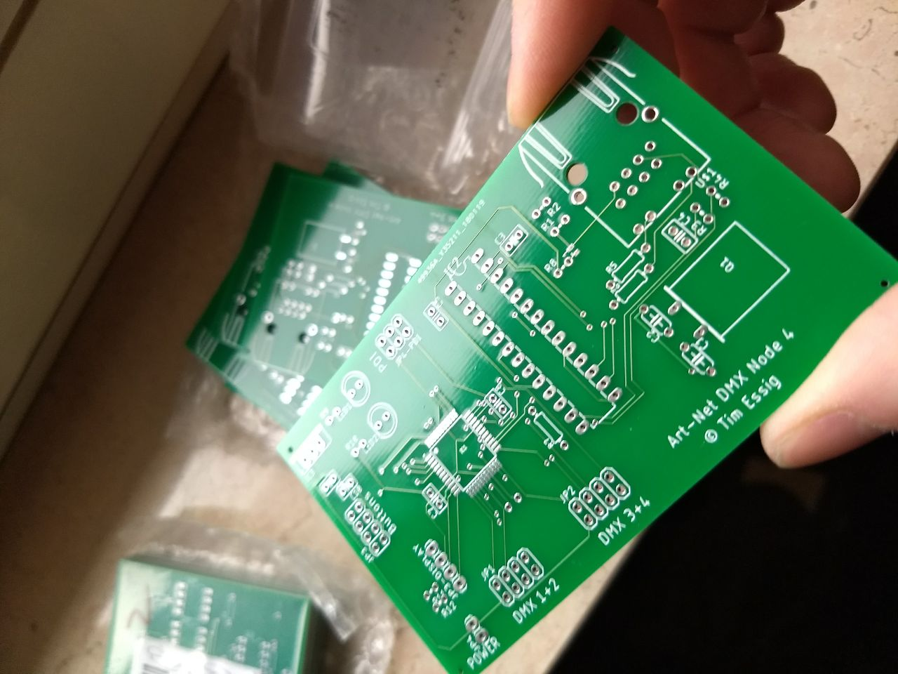
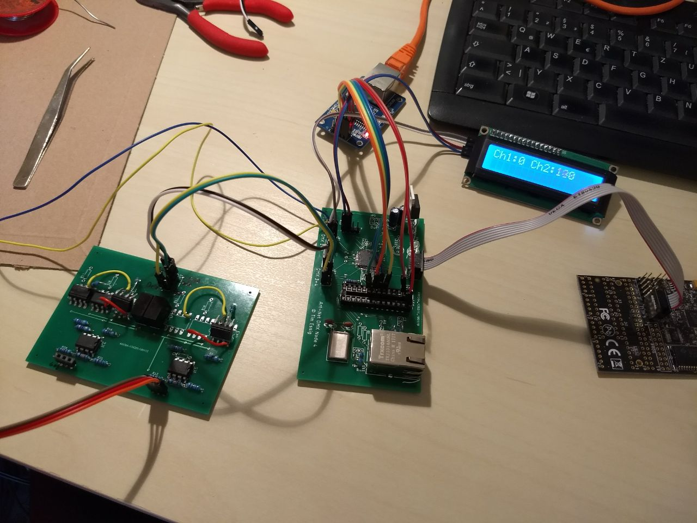
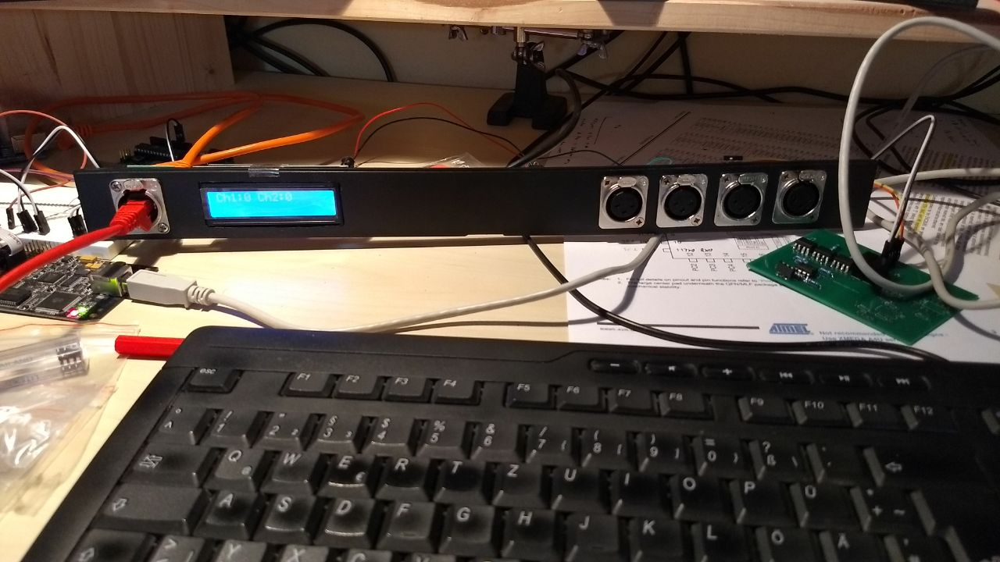

 
# ArtNetNode 4

Small Xmega32 and enc28j60 based DYI ArtNet Node with 4 DMX ports.

## Features:
    - 4 DMX Outputs(full 512 channels)
    - Testes framerate: 4x 52 FPS
    - Web Interface for configuration(WIP, see TODO)
    - industry standard 19" 1U housing
    - Ported [EtherCard](https://github.com/jcw/ethercard) to XMega32

## TODO:
 - [ ] Finish WebInterface
 - [ ] Persist Settings(Name, IP, Universes)
 - [ ] Use DMX Ports as Input
 - [ ] Implement ArtPoolReplay
 - [ ] Implement other ArtNet functions(setName,...)
 - [ ] Upload Eagle-File's

 ## Images

 
 First Prototype

 
 Fresh PCB's

 
 Soldered PCB's

 
 Mounted front plate

 
 Full Housing

